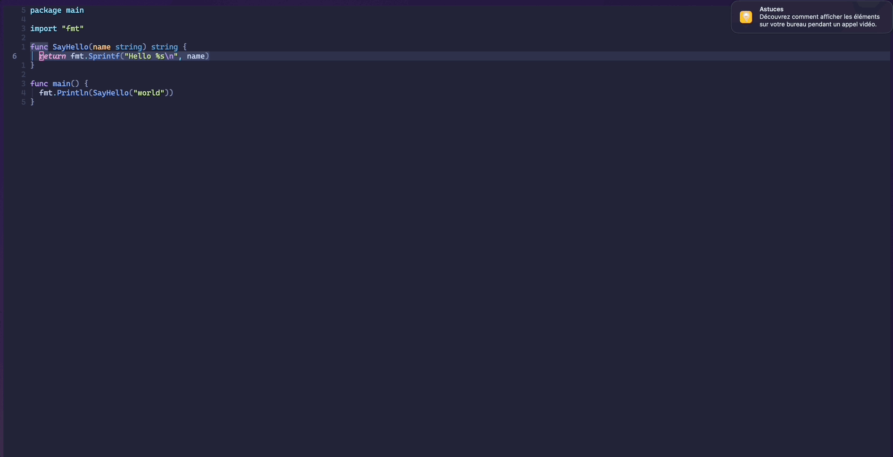

# Golang-code-actions

## Overview

The aim of golang-code-actions is to provide a custom set of code-actions based on the null-ls API
in order to facilitate the golang workflow and complete the missing features of null-ls.

## Pre-requisite

- [nvim-treesitter][nvim-treesitter]
- [null-ls][null-ls]
- [golang][golang-website]

## Installation

### LazyVim

```lua
{
  "BoyerDamien/golang-code-actions.nvim",
  dependencies = {
    "jose-elias-alvarez/null-ls.nvim", "nvim-treesitter/nvim-treesitter"
  },
  build = "./install",
  config = function()
    require("golang-code-actions").setup()
  end
}
```

## Features

### Unit-tests generation



[nvim-treesitter]: https://github.com/nvim-treesitter/nvim-treesitter
[null-ls]: https://github.com/jose-elias-alvarez/null-ls.nvim
[golang-website]: https://go.dev
